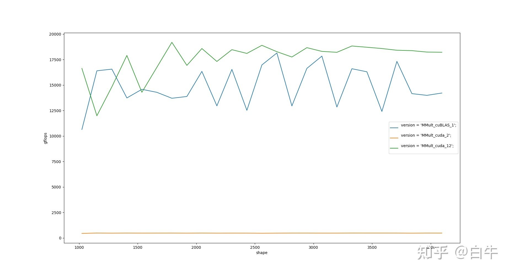

# how-to-optimize-gemm

[English](README.md) | [简体中文]

row-major matmul optimization

| backend | armv7 | aarch64 | aarh64-int8 | cuda | cuda-int4 | vulkan | x86 |
| ----------- | ------- | -- | ---------- | ---------- | ---------- | --------- | --- |
| support | ✔️ | ✔️ | ✔️ | ✔️ | WIP | ✔️ | ✅ | 

所有后端和对应教程

| backend | tutorial |
| ------- | -------- |
| aarch64 | [GEMM 入门](https://zhuanlan.zhihu.com/p/65436463) |
| aarch64 | [GEMM caching](https://zhuanlan.zhihu.com/p/69700540) |
| aarch64-int8 | - |
| armv7   | [ARMv7 4x4kernel 懒人优化小实践](https://zhuanlan.zhihu.com/p/333799799) |
| cuda    | [cuda 入门的正确姿势：how-to-optimize-gemm](https://zhuanlan.zhihu.com/p/478846788) |
| cuda-int4 WIP | [int4 炼丹要术](https://zhuanlan.zhihu.com/p/580752390)
| vulkan  | [如何火急火燎地上手 Vulkan](https://zhuanlan.zhihu.com/p/487583258) |


## 一、编译运行

所有后端的用法都是类似的：

1. 打开要用的后端目录，初次运行把 `makefile` 的 `OLD` 和 `NEW` 改成同一个实现，例如
```bash
$ cd aarch64
$ cat makefile
OLD    := MMult_4x4_10
NEW   := MMult_4x4_10
..
```

2. `make run` 即可。`makefile` 会编译运行 `NEW`指向的实现，同时把 `output_MMult_4x4_10.m` 复制到 `output_new.m`
```bash
$ make run
$ cat output_new.m
```

3. 直接看数字可能不直观，绘制折线图
```bash
$ python3 -m pip install -r ../requirements.txt
$ python3 plot.py
```

## 二、各后端差异

具体到每个硬件，有细微差异：
* `NEW` 选取的名字可能不一样
* vulkan/int4 需要事先安装点依赖

## 1. armv7 和 aarch64

A. 准备 armv7/aarch64 linux 开发环境，树莓派/rk3399/aws arm server 都可以。

B. 默认情况下`ARCH := native`。直接编译运行即可
```
$ cd armv8 && make run
```

## 2. aarch64 int8 
[GEMM 入门](https://zhuanlan.zhihu.com/p/65436463) 发布后，有不少同学问如何写一个 int8 gemm。

[chgemm](https://github.com/tpoisonooo/chgemm) 是个可用的 int8 gemm 库。相对于本教程中的代码，区别在于:
1. 处理了边界问题，不像教程里只考虑尺寸为 4 的倍数的情况;
2. int8 最高达到了 18.6 gflops（相对 fp32 理论极限只有14.3，gemmlowp大约 12-14gflops）;
3. 基于对称量化原理，输入数值范围必须在 \[-127, +127\]，不能出现 -128；
4. 内置小例子，如何集成到 android studio （啊似乎是安卓开发的活儿）

chgemm 已合入[ncnn](https://github.com/tencent/ncnn) INT8 卷积实现。


## 3. x86 原版
x86 引用的 [flame](https://github.com/flame/how-to-optimize-gemm/tree/4fcf39bd0963bca62f04bef2aeb49a06ee28508b) 是最初的实现，和这个 repo 有些差异：

1. 原作是**列主序**`x86 SSE`版本
2. 两个都是教程，现在写的 `MMult_4x4_17.c`能到 CPU 峰值的 70%
3. 现在没处理边界问题，只考虑 MNK 均为 4 的倍数的情况；`sub_kernel`也只写了最简单的一种汇编。实用需要简单调整一下；
4. 绘图方面扔掉了 `octave`（嵌入式设备配置一次环境太麻烦），改用 `python`。


## 3. CUDA
cuda 版**超过 NVIDIA cuBLAS 的速度**

* 绿色的是自己的实现
* 蓝色的是 cuBLAS
* 都是 3080 不带 tensorcore



1. 需自行安装 cuda 驱动和 nvcc
2. 需要 CPU OpenBLAS 做 baseline，验证数值正确

## 4. Vulkan

1. vulkan build 依赖 kompute API 包装，详见 [vulkan build 文档](https://github.com/tpoisonooo/how-to-optimize-gemm/tree/master/vulkan)

2. 时间关系，没有做到峰值。更多的是介绍如何学习 compute shader

## 五、CUDA int4

WIP

## 介绍一些工具

* [megpeak](https://github.com/MegEngine/MegPeak): 测量硬件极限性能用，支持 arm/x86/OCL..

* [perf](https://perf.wiki.kernel.org): linux 基本包里就有，做系统级性能分析，可反汇编
* [YHs_Sample](https://github.com/Yinghan-Li/YHs_Sample): 巨佬的实现
